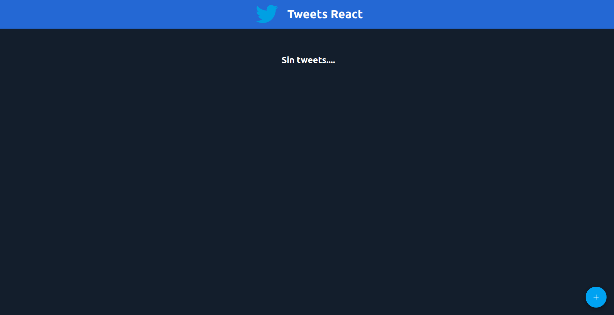
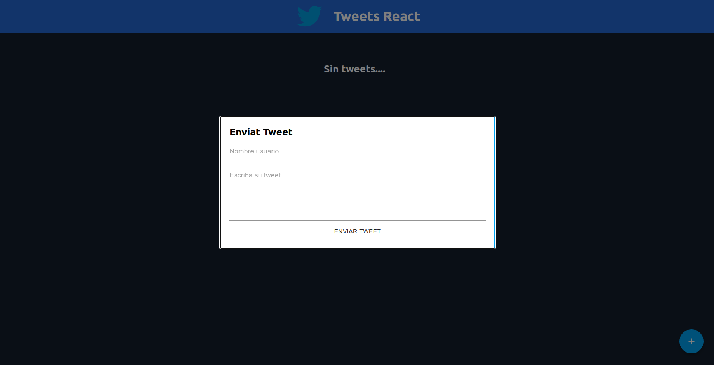
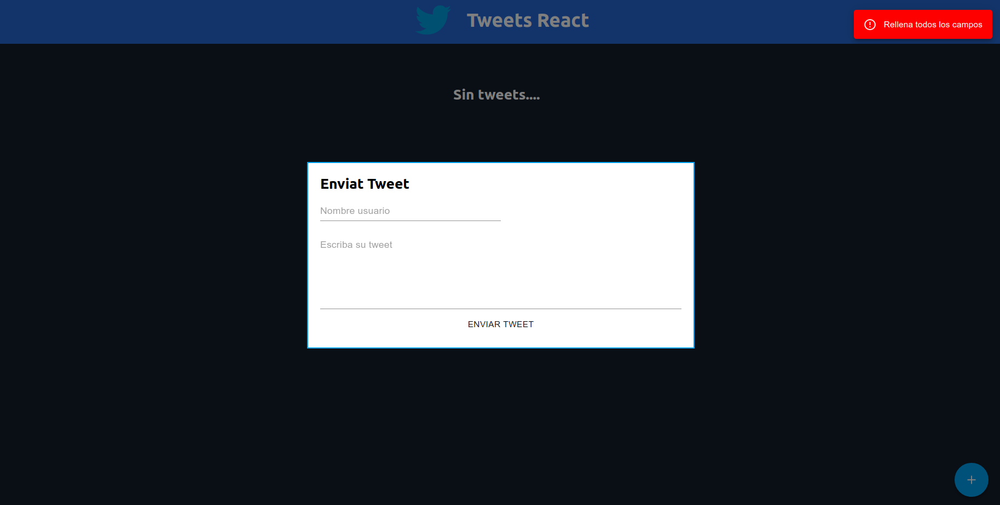
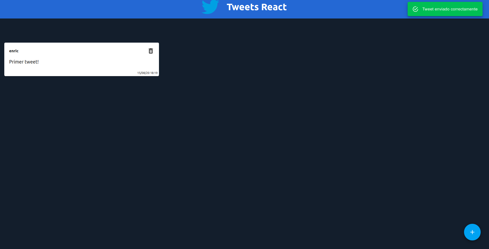
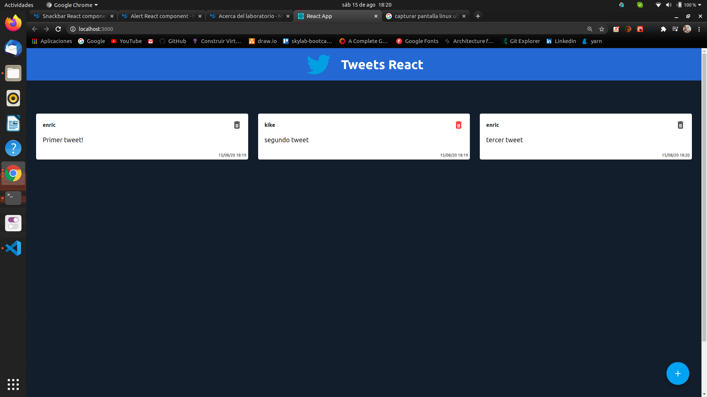

This project was bootstrapped with [Create React App](https://github.com/facebook/create-react-app).

# *Tweets Simulator*

Pequeño proyecto donde creamos un simulador de tweets con ReactJS usando Hooks (useState & useEffect) y enviando props por los componentes. En la parte visual hemos usado Material UI para crear los componentes y usamos Sass para darles estilos.

### `capturas de pantalla`

Home de cuando iniciamos la aplicación, podemos ver que si todavia no hemos creado ningún tweet nos sale un span avisandonos...

Vamos añadir un tweet en el icono de + (esquina derecha inferior)

podemos comprobar como nos aparece un modal donde nos dejará crear un tweet poniendo el nombre y el contenido, pero que pasa si no llenamos algun campo?

Y aquí observamos como nos avisa de ojo! rellena todos los campos o será imposible enviar el tweet. Probemos de rellenar todos los campos.

y...voilá! ya hemos conseguido lo que queríamos... podemos ver como está el nombre de usuario, el tweet, y hemos usado la libreria moment para poner la fecha y hora del tweet.

Vamos a poner el resultado final para finalizar, teniendo en cuenta que cada vez que borremos un tweet automaticamente se recargará la página donde se visualizan los que quedan

### `Agradecimientos`
+ Agustin Navarro Galdon (profesor FrontEnd developer)